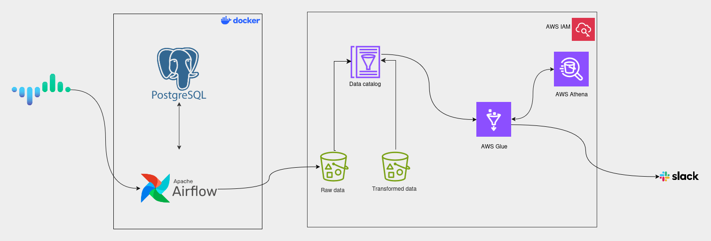

# End-to-End Crypto Data Pipeline

### 📊 Project Overview
An automated ETL data pipeline that extracts live cryptocurrency market data from a REST API, orchestrates cloud processing, and serves the data for querying and visualization. 

This project demonstrates core Data Engineering principles: API extraction, cloud storage management, asynchronous orchestration, and data observability.

### 🏗️ Architecture

  

### 🛠️ Tech Stack
* **Orchestration:** Apache Airflow (Dockerized), Slack API (Webhooks)
* **Storage & Compute:** Amazon S3, AWS Glue (Python Shell), AWS IAM
* **Serving & Analytics:** AWS Athena (Presto/Trino SQL), AWS Glue Data Catalog
* **Visualization:** Amazon QuickSight (to do)
* **Languages:** Python (`pandas`, `awswrangler`, `boto3`), SQL

### 🚀 Key Engineering Highlights

* **Cloud Data Processing:** Extracted raw JSON payloads from the CoinCap API and processed them into strongly-typed, Snappy-compressed Parquet files. Enforced schema rules and partitioned the data by date (`year/month/day`) for optimized querying.
* **Optimized Orchestration:** Implemented Airflow Sensors with `mode='reschedule'` to monitor asynchronous AWS Glue jobs. This ensures Airflow worker nodes are released and not held hostage while waiting for external cloud tasks to finish.
* **Data Observability:** Integrated a custom Slack Webhook to deliver real-time pipeline status alerts (Success/Failure) for proactive monitoring.
* **Serverless Analytics & Automations:** Bypassed expensive AWS Glue Crawlers by utilizing the `awswrangler` library to automatically register new daily S3 partitions directly into the Glue Data Catalog. 
* **Cost Optimization:** Implemented strict S3 Lifecycle Rules to automatically purge ephemeral Athena query results after 7 days, maintaining a zero-waste storage environment.

### 🛣️ Path to Production
While this repository currently utilizes a local Dockerized Airflow instance for isolated development and testing, the decoupled architecture is explicitly designed to be lifted and shifted to a fully managed enterprise environment, such as **Amazon Managed Workflows for Apache Airflow (MWAA)** or deployed via Helm to a **Kubernetes (Amazon EKS)** cluster utilizing the `KubernetesExecutor` for horizontal scaling.